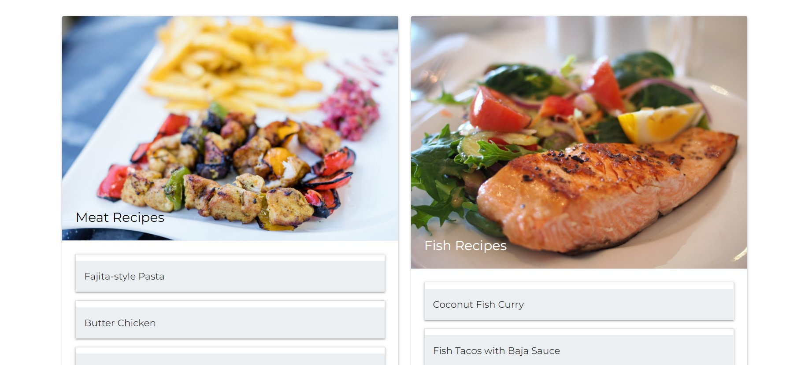
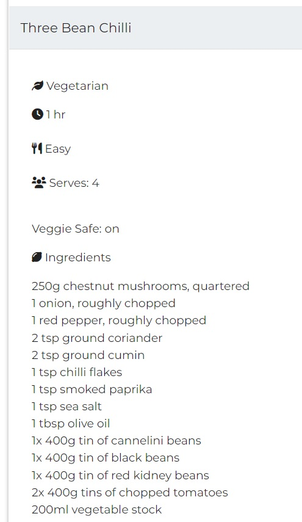

# Portfolio Project 3 - Data Centric Backend Development

## Online Cookbook - Live Site

[View Live Site](http://flask-cookbook-project-3.herokuapp.com/)

## Business Objectives

As someone who thoroughly enjoys cooking but often struggles to relocate favourite recipes, I have designed and created a website that allows users to store all of their favourite recipes in one space. 

The primary focus for this website is to provide a database for the user so that they can store and access their own chosen recipes with just a few clicks. Users will also be able to add and delete recipes as they please.

The application is designed to be responsive to all screen sizes and accessible to all users, so that navigation is easy for everyone, no matter what device is being used. My goal is to achieve this with a visually appealing, interactive UX, which encourages users to:
- store their favourite recipes in an organised manner
- create/update/delete recipes as they choose
- share the website with friends and family to encourage them to sign up
- follow the company's social media platforms to see other users' recipes and ideas

## Homepage Mockup

## User Experience (UX)
### User Stories
**First Time Visitor Goals**

1. As a first time visitor, I want to understand what the site's purpose is so that I know whether or not I want to explore further.

2. As a first time visitor, I want to be able to easily register so I can access the rest of the site.

**Returning Visitor Goals**

3. As a returning user, I want to upload my favourite recipes and store them so they are easily accessible for another time.

4. As a returning user, I want to manage my recipes by creating, updating and deleting them when necessary.

**Frequent Visitor Goals**

5. As a frequent user, I want to be able to follow the company's social media platforms so that I can follow them and share my own recipes with them.

6. As a frequent user, I want to be able to store a large variety of recipes in separate categories, in an organised manner, that are easy to locate when I need them.

**Site Owner Goals**

7. As a site owner, I need to enforce some basic access control when a user is editing or deleting data in order to prevent unauthorised editing or deletion of user uploaded data.

## Design
### Colour Scheme
Colour contrast checks were made throughout the process of building the project to save going back and re-doing colours that did not work together.

The main colour scheme is clean and crisp, using different shades of *blue-grey* and *white*, in order to keep the site neutral. The look and feel I wanted to go for was the same look you want to go for with a clean kitchen. People feel most inspired to cook a nice meal when they have a fresh, clean looking kitchen. I wanted that same inspiration throughout the site, and that encourages users to keep their recipes organised.

There are some photographic images throughout, to tie in well with the theme of the site. These images are used on the landing page, and the recipe and category cards.

The text throughout the site is either white against the blue-grey background, or a dark grey/black against a white background, in order to keep the clean, crisp look throughout the site.

### Typography

Fonts are imported into the CSS file via [Google Fonts.](https://fonts.google.com/)

To keep up with the clean and neutral look of the site, I chose to use just one font that is easy and simple to read.
I have chosen to use the font family of 'Montserrat', with a fallback font of 'san-serif', in the event of the preferred font failing to import. This font will hopefully create a positive user experience when first entering the site as it exudes a professional yet simplistic mood.

### Imagery

Photographic imagery is used in some parts of the site, all images are sourced from [Pixabay.](https://pixabay.com/photos/search/)

The landing page consists of a header, background image and a footer. The image has been slightly darkened and the opacity reduced so that it wasn't too vibrant against the subtle colours of the header and footer.

This image gives the user a good idea of what the site is about upon entering. The appealing image of fresh food should give the user motivation to explore the site further.

The Recipes page that contains all of the users' recipes consists of 4 diet specific categories. Each category has a card element containing an image related to that category, e.g. an image of a vegetable curry for the vegetable category.

The Manage Categories page consists of 4 images for each category, these images are the same for each category for ease which I may change at a later date.

## Wireframes
Wireframes for the original design concepts across all devices were created using [Balsamiq.](https://balsamiq.com/wireframes/)

**Home Page**

The landing page explains the purpose of the site to new and returning users through imagery and subheadings. Functionality is limited from this page as users are only able to register, log-in or visit the company's social media platforms.

**Register Page**

Register page enables the user to create unique log-in credentials based on an alphanumeric Username and alphanumeric Password. Back-end logic tests for duplicate entries and password confirmation.

**Log-in Page**

For returning users there is a log-in page to enable access to the full functionality of the site.

**Profile Page**

Upon successful registration or logging in, users are directed to their profile page, consisting of a welcome message that contains the session users' username.

**Recipe Page**

The Recipe page is the main attraction/functionality of the site. By retrieving the data from the Mongo database, recipes are displayed by category for the user to access. Users are also able to search and filter recipes by entering a recipe name or diet category.

**Add Recipe Page**

Users can add a recipe by filling out the following input fields:

- Recipe Name
- Veggie Safe (on/off switch)
- Diet Category
- Cooking Time
- Cooking Skill Level
- Serves (how many)
- Ingredients
- Method

**Edit Recipe Page**

Each recipe has a edit & delete button. By clicking the *edit* button, users are directed to the Edit Recipe page, where all fields hold the value of the already submitted recipe. Users can change the input text as necessary and update to the database.

**Manage Categories Page**

This page is restricted to the admin only, where they can choose to create, update or delete diet categories.

**Add Category Page**

After clicking the *Add Category* button on the previous page, users can populate the input field with a new category.

**Edit Diet Category Page**

After clicking the *Edit* button on a specific category card, users can populate the input field with the updated category.

## Database schema

I used Mongo DB Atlas, a non-relational database to store and retrieve all of the user input data, illustrated below:

- The *Users* collection stores user data, including a usernsame and password that they will input each time they are required to log in. The username is used to populate the *created by* field in the *Recipes* collection when a user uploads a new recipe.

- The *Recipes* collection is the largest in the database and stores all user input regarding each recipe, as well as data retrieved from other collections. I included all elements of a recipe that I thought were most relevant for each field.

- The *Categories* collection consists of user input regarding the diet type of that recipe. Which is then injected into the *Recipes* collection as the *diet_name*.

## Features
### Existing Features
| Feature | Description | Image URL |
| ------- | ----------- | --------- |
| Landing | Landing page to convey the purpose of the website to new and returning users. | |
| Header | Logo and nav bar allow user to navigate through the site with ease. Burger icon displays on smaller devices. | [Header](/documentation/images/features/header.jpg) |
| Footer | Sign up option and social media icons direct the user to the company's social media platforms. | [Footer](/documentation/images/features/footer.jpg) |
| Register | Provides the opportunity for new users to sign-up quickly and efficiently. | [Registration Page](/documentation/images/features/register.jpg) |
| Log-In | Provides the opportunity for returning users to log-in quickly. | [Log-In Page](/documentation/images/features/log-in.jpg) |
| Profile Page | Users are directed to a welcome message displaying their username. | [Profile Page](/documentation/images/features/profile.jpg) |
| Recipes | Page where all users' recipes are displayed. | [Recipes Page](/documentation/images/features/recipes.jpg) |
| Recipe Search | Users can text search for a recipe using the recipe name or diet category. | [Recipe Search](/documentation/images/features/recipe-search.jpg) |
| Drop Down Recipes | Recipes are organised with dropdown select elements. Users select/drop the recipe they want to view. | [Dropdown Recipe](/documentation/images/features/dropdown.jpg) |
| Add Recipe | Users can create and upload a recipe to their database. | [Add Recipe](/documentation/images/features/add-recipe.jpg) |
| Edit Recipe | Enables users to modify all of the fields for any of the recipes they uploaded. Original data is uploaded from the database into the value fields until the user modifies. | [Edit Recipe](/documentation/images/features/edit-recipe.jpg) |
| Delete Recipe | Allows user to delete a recipe that they have uploaded. | [Delete Recipe](/documentation/images/features/delete.jpg) |
| Manage Categories | Admin access only. Admin has the ability to create, update or delete diet categories. | [Manage Categories Page](/documentation/images/features/manage-cat.jpg) |
| Log-Out | Logs user out and clears session | [Log Out](/documentation/images/features/logout.jpg) |

### Security Features

Although certain security features were not required for this project I have chosen to implement basic measures to provide some protection against unauthorised access to other users data.

| Feature | Description | Image URL |
| ------- | ----------- | --------- |
| User Log-In | A simple username and password is required for registration. Password gets hashed using Password Hash from the Werkzeug Library. | [Log-In Security](/documentation/images/features/login-security.jpg) |
| Session Cookie | Upon registering or logging in, a unique session cookie is generated for the duration of the users' session. Recipe uploads are saved in the database against the session cookie username. | [Session Cookie](/documentation/images/features/session.jpg) |
| Restricted Access | Users cannot edit or delete recipes that are not uploaded by them. Only admin users can manage categories. In the Image URL, you can see that only the username of *laurajones* will be able to edit or delete the recipe. | [Restricted Access](/documentation/images/features/access.jpg) | 
| Password Confirmation | When registering, a password confirmation input field is displayed to ensure the user signing up is genuine. | [Password Confirmation](/documentation/images/features/password-conf.jpg) |

### Features yet to implement

hide recipes(dropdown)
limit recipes befroe a next button shows
household recipes

## Technologies Used
### Languages
- HTML5
- CSS3
- Python
- JavaScript

### Libraries/Integrations

- Flask - Flask micro-framework, links with jinja to create the webpages.

- Jinja - The project uses the Jinja templating engine.

- Materialize CSS - Grid system as well as other elements used throughout the site.

- Hover.css - Used in the Footer to highlight when links are hovered over.

- Google Fonts - Imported via CSS.

- Font Awesome - Icons used for social media links as well.

- Balsamiq - Used to create wireframes for the project.

### Database Management System

- MongoDB Atlas

### Version Control, Storage & Hosting

- Chrome Dev Tools - Heavily used to fix any spacing issues as well as testing responsivity.

- Github - To store repositories and codes after being pushed on Gitpod.

- Git - Used for version control and tracking changes made to files.

- Gitpod - Used for the workspace for this project.

- Heroku - Deployment site.

- Multi Device Mockup Generator (techsini) - To create an image of what the project will look like on various devices. [TechSini.com](http://techsini.com/multi-mockup/index.php)

- WebAIM Contrast Checker - To test colours throughout the site for whether or not they will produce good user experience.

- W3C Markup Validator - 

- W3C CSS Validator - 

- JS Validator - 

## Testing

## Known Bugs and Fixes

## Deployment
This project was created using Gitpod, which enabled me to stage and commit the files via Git (version control) and pushed into the respository on Github.

To deploy the project on Github:
Select the repository you wish to deploy.
Click the Settings tab within that repository.
In the Settings, scroll down and select Pages.
In the Source section, click Branch and select the main option, click Save.
The URL for the deployed project is now saved in Pages.
Forking the Github Repository:
Choose to fork the repository by making a copy. You can then make changes to the copy without it affecting the original repository.

Select the repository you wish to fork.
In the top right corner of the page (under your account icon) there will be an option to Fork.
By selecting Fork you will now have a copy of the respository in your own Github account.
Cloning the Github Repository:
Select the repository you wish to clone locally.
Above the files, locate the Code dropdown menu.
Select and copy the link appropriately (HTTPS, SSH, Github CLI).
Open the terminal and change the directory to where you want the cloned version to be located.
Type git clone and paste the copied link.
Press Enter to create local clone.

## Credits
Code
Stackoverflow Forums

As stated in the comments of the CSS file (lines 4-5), for providing a solution to fix an issue regarding white space down the right side of the page.
Brian, Program Director, Code Institute

For giving me the idea to have the navbar on the right side of the header (custom CCS used).
Matt Rudge, Code Institute

For providing me the idea to use a hover effect on icons. I used this effect on the contact icon and social media icons (custom CSS styling was used).
The idea for the style and layout for the contact form was inspired by the Love Running Project. Again, I used custom CSS styling.
Maggie Walsh (fellow Stack member)

For sharing advice with members regarding the basic structure of a README.md file.
Media
Jess Hynes (client)
Providing the photographic images to use as hero images.
Providing permission to use YouTube links to videos that she has recorded and uploaded from her home studio.
Acknowledgements
Code Institue Tutors

For showing me guidance when using the display attribute to align content in rows and columns, so that it is spaced evenly across the page.
Felipe Souza Alarcon, my Code Institute mentor throughout the course

For continous support and professional guidance during the process of building my project.
Fellow Slack Community members

For responding when in times of need.

## Personal Development
Following a session with my Code Institute mentor, I have noted that for future projects I will pay extra attention to how I am writing up CSS code, so that I don't end up with repetitive, unnecessary lines of code. In the meantime I am going to research different methods and ways of creating effective code that does not use a large amount of lines within the CSS file.

After writing my Personal Development section I decided to go back into my CSS file and attempt to slim down on the amount of code being used. I was able to remove approx. 200 lines of code by testing with Chrome Dev Tools and removing any unnecessary or repetitive code.